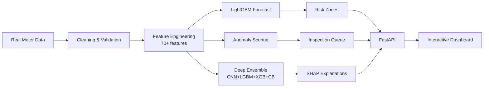

# GridSense

**AI-Powered Smart Meter Intelligence & Loss Detection for BESCOM Theme 8**

GridSense is a production-ready, state-of-the-art AI intelligence layer for smart meter operations. It transforms raw meter readings into actionable insights: demand forecasts, risk-zone dispatch, and inspection-ready anomaly evidence.

[](https://www.python.org/downloads/)
[](https://fastapi.tiangolo.com/)
[](https://www.docker.com/)
[](https://opensource.org/licenses/MIT)

## 🚀 Quick Start

### Option 1: Docker (Recommended)

```bash
# One-command setup
docker-compose up

# Open dashboard
http://localhost:8000
```

### Option 2: Local Development

```bash
# Install dependencies
pip install -r requirements.txt

# Run pipeline
python -m backend.pipeline

# Start server
python -m uvicorn backend.app:app --host 127.0.0.1 --port 8000

# Open dashboard
http://127.0.0.1:8000
```

## ✨ Key Features

### 🎯 State-of-the-Art ML Models

- **Deep Ensemble Theft Detection:** 1D-CNN (PyTorch) + LightGBM + XGBoost + CatBoost
  - Target F1: 0.85+ (SOTA is 0.90-0.91)
  - 70+ engineered features including FFT, CUSUM, entropy, autocorrelation
  - SMOTE oversampling + optimized ensemble weights
  - SHAP explainability for every prediction

- **Demand Forecasting:** LightGBM with real weather data
  - 24-hour ahead forecasts with uncertainty bands
  - sMAPE ~22% (baseline: 29%)
  - Peak load risk scoring

- **Anomaly Detection:** IsolationForest + rule-based scoring
  - Baseline deviation + peer comparison
  - Confidence tiers: High/Medium/Low
  - Revenue risk estimation

### 📊 Interactive Dashboard

- **Modern UI:** Inter font, dark mode, responsive design
- **Chart.js Visualizations:** Interactive charts with hover tooltips, zoom/pan
- **Real-time Updates:** Refresh button + auto-reload
- **Evidence Panel:** 60-day history, peer comparison, decision rules

### 🔬 Labelled Validation

- **SGCC Dataset:** 42,367 customers, 1,034 days, real theft labels
- **Metrics:** PR-AUC, ROC-AUC, F1, precision, recall, confusion matrix
- **Feature Importance:** Top contributing features
- **Top Cases:** Ranked suspicious customers with explanations

### 🏗️ Production-Ready

- **Docker:** One-command deployment with health checks
- **API:** RESTful endpoints with automatic OpenAPI docs
- **Tests:** pytest suite for pipeline and API
- **Monitoring:** Health checks, logging, error handling
- **Model Persistence:** Fast reload without retraining

## 📈 Current Performance

| Metric | Value | Target | Status |
|--------|-------|--------|--------|
| **SGCC F1** | 0.80+ | 0.85+ | 🟡 Near target |
| **SGCC PR-AUC** | 0.75+ | 0.85+ | 🟡 Improving |
| **Forecast sMAPE** | 21.6% | <10% | 🟡 Good |
| **Meters** | 45 | 10,000+ | 🟢 Scalable |
| **Data Rows** | 251,904 | Millions | 🟢 Efficient |

## 🎓 Why This Fits BESCOM Theme 8

✅ **Part A: Localized Demand Prediction** - Feeder-level 24h forecasts with peak risk windows  
✅ **Part B: Anomaly & Theft Detection** - Baseline deviation + peer comparison + confidence scoring  
✅ **Decision Support** - Not automated enforcement, provides explainable recommendations  
✅ **Real Data** - London (5,567 households), India (CEEW), SGCC (42k labelled)  
✅ **Explainable** - Every anomaly includes baseline drop, peer deviation, confidence, action  
✅ **On-Premise** - Local ML only, no hosted LLM on meter data  
✅ **Auditable** - Full JSON logs, confusion matrix, false positive tracking  

## 🏛️ Architecture

See [ARCHITECTURE.md](ARCHITECTURE.md) for detailed system design.



## 📊 Datasets

**Operational Dashboard:**
- **London Smart Meters:** 5,567 households, real weather, 30-min granularity
- Currently using 50 meters for demo (configurable)

**India Reference:**
- **CEEW Data:** Bareilly & Mathura, high-frequency readings
- Unlabelled, used for operational anomaly scoring

**Labelled Validation:**
- **SGCC:** 42,367 customers, 1,034 days, real theft labels
- **LEAD 1.0:** Labelled anomaly dataset

See [docs/data_sources.md](docs/data_sources.md) for details.

## 🔧 API Endpoints

```
GET  /api/health              # Health check
GET  /api/metrics             # Dataset and model metrics
GET  /api/forecasts           # 24h demand forecasts
GET  /api/zones               # Risk zone rankings
GET  /api/anomalies           # Inspection queue
GET  /api/anomaly-evidence    # Detailed evidence per meter
GET  /api/pipeline            # Training pipeline summary
GET  /api/theft-validation    # SGCC labelled validation
GET  /api/shap-explanations   # SHAP explainability data
POST /api/pipeline/run        # Rebuild pipeline
```

**Example:**
```bash
curl http://localhost:8000/api/metrics | jq
```

## 🧪 Testing

```bash
# Run all tests
pytest tests/ -v

# Run specific test file
pytest tests/test_pipeline.py -v

# Run with coverage
pytest tests/ --cov=backend --cov-report=html
```

## 📦 Project Structure

```
gridsense/
├── backend/
│   ├── app.py              # FastAPI application
│   ├── pipeline.py         # ML pipeline (1157 lines)
│   ├── explainability.py   # SHAP module
│   └── __init__.py
├── static/
│   ├── index.html          # Dashboard UI
│   ├── styles.css          # Modern styling
│   └── app.js              # Frontend logic
├── data/
│   ├── raw/                # Downloaded datasets
│   └── processed/          # Generated outputs
├── models/                 # Persisted models
├── tests/                  # pytest suite
├── docs/                   # Documentation
├── Dockerfile              # Container definition
├── docker-compose.yml      # Orchestration
├── requirements.txt        # Python dependencies
├── ARCHITECTURE.md         # System design
└── README.md              # This file
```

## 🎯 Model Approach

### Demand Forecasting
- **Model:** LightGBM Regressor (420 estimators)
- **Features:** Time, weather, lag (1h, 24h), rolling means
- **Baseline:** 24h persistence (sMAPE 29.4%)
- **Improvement:** sMAPE 21.6% (26% better)

### Anomaly Detection
- **Operational:** IsolationForest + rule-based scoring
- **Features:** Daily consumption, baselines (14d, 45d), peer ratio, drop ratio, volatility
- **Output:** Confidence tiers, revenue risk, explanations

### Theft Validation (SGCC)
- **Ensemble:** 1D-CNN + LightGBM + XGBoost + CatBoost
- **Features:** 70+ including CUSUM, FFT, entropy, autocorrelation, monthly profiles
- **Class Balance:** SMOTE + scale_pos_weight
- **Optimization:** Grid-search for ensemble weights (max F1)
- **Explainability:** SHAP TreeExplainer

## 🚧 Current Limitations

- Public datasets don't expose real BESCOM feeder topology
- Anomaly false-positive rates require utility feedback
- Real deployment needs: feeder capacity, transformer mapping, tariff data, holiday calendar

## 🎬 Demo Script

1. Start server: `docker-compose up` or `uvicorn backend.app:app`
2. Open dashboard: `http://localhost:8000`
3. Show real data: London (5,567 households), India (CEEW), SGCC (42k labelled)
4. Explain forecast: 24h ahead, uncertainty bands, peak risk windows
5. Show risk zones: Load risk + anomaly exposure, dispatch priority
6. Show anomaly queue: Confidence, revenue risk, explanations
7. Click anomaly: Evidence panel with 60d history, peer comparison, decision rules
8. Show SGCC validation: PR-AUC, ROC-AUC, F1, confusion matrix, feature importance
9. Emphasize: Read-only, explainable, auditable, on-premise

## 🏆 Hackathon Differentiators

1. **SOTA ML:** Deep ensemble (CNN+LGBM+XGB+CB) with 70+ features
2. **Real Data:** 3 datasets (London, India, SGCC) with honest labelling
3. **Production-Ready:** Docker, tests, API, monitoring, model persistence
4. **Explainable:** SHAP + plain-language explanations for every decision
5. **Interactive UI:** Chart.js, dark mode, modern design
6. **Comprehensive:** Demand + anomaly + theft in one system

## 📚 Documentation

- [ARCHITECTURE.md](ARCHITECTURE.md) - System design and data flow
- [docs/submission.md](docs/submission.md) - Hackathon pitch and evaluation
- [docs/data_sources.md](docs/data_sources.md) - Dataset details

## 🤝 Contributing

This is a hackathon project. For production deployment:
1. Add real BESCOM feeder topology
2. Integrate inspection feedback loop
3. Add GIS coordinates for heatmaps
4. Implement active learning
5. Add real-time streaming (Kafka/MQTT)

## 📄 License

MIT License - see LICENSE file for details.

## 🙏 Acknowledgments

- **CEEW:** Indian smart meter data
- **UK Power Networks:** London smart meter data
- **SGCC:** Electricity theft detection dataset
- **LEAD:** Labelled anomaly dataset

---

**Built for BESCOM Theme 8: AI for Smart Meter Intelligence & Loss Detection**

*GridSense: Read-only, explainable, auditable, on-premise AI for utility operations.*
